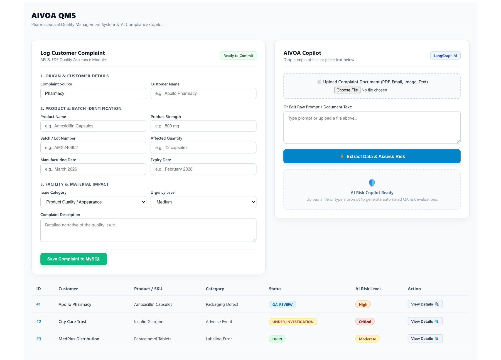

# AIVOA-QMS — Complaint Review Interface

AIVOA-QMS is a pharmaceutical complaint-management system built around a simple problem: complaint data often arrives as unstructured text or documents, while quality teams need structured records, risk assessment, traceability, and a consistent review workflow.

This repository contains the frontend of that system. It gives a quality user one place to submit a complaint, review the extracted information, inspect the AI-assisted assessment, and move the complaint through its lifecycle.



## What the product does

- Complaint entry from natural-language text
- PDF/document upload
- AI-assisted extraction into a structured complaint record
- Completeness checks before review
- Risk-assessment results and supporting information
- Root-cause and CAPA suggestions
- Duplicate-complaint warnings
- Complaint status and lifecycle management

AI is used to assist the workflow rather than replace the user's review.

## Product flow

```text
Complaint text / document
          ↓
   Extraction interface
          ↓
 Structured complaint record
          ↓
 Completeness + duplicate checks
          ↓
    Risk assessment
          ↓
 Human review / lifecycle update
```

The frontend communicates with the companion FastAPI backend through HTTP APIs. Redux Toolkit manages application state and Axios handles the API layer.

## Architecture

```text
React UI
   │
   ├── Complaint entry
   ├── Document upload
   ├── Review panels
   └── Risk assessment views
          │
          ▼
     Redux Toolkit
          │
          ▼
        Axios
          │
          ▼
   AIVOA-QMS Backend
```

## Tech stack

- React 19
- Redux Toolkit
- React Router
- Vite
- Axios
- JavaScript
- HTML/CSS

## Run locally

```bash
npm install
cp .env.example .env      # optional, see below
npm run dev
```

### Pointing at a backend

The API base URL defaults to `http://localhost:8000`. To use a different
host, set `VITE_API_BASE_URL` in `.env`:

```
VITE_API_BASE_URL=http://localhost:8000
```

Every request goes through `src/services/api.js`, so this is the only place
the backend address is configured.

### Lint and build

```bash
npm run lint     # eslint
npm run build    # production bundle
```

CI runs both on every push.

## Related repository

The API, AI workflow, database layer, and complaint-processing logic live in the companion **AIVOA-QMS-Backend** repository.

## Project status

This is a working product-oriented prototype. The interface and API workflow are designed around an actual complaint-review process. Enterprise authentication, permissions, audit infrastructure, and regulated validation are outside the scope of this project.

## License

MIT — see [LICENSE](LICENSE).

## Author

**T. Rushendar Reddy**  
B.Tech — Artificial Intelligence and Machine Learning  
Vignan University, Hyderabad
